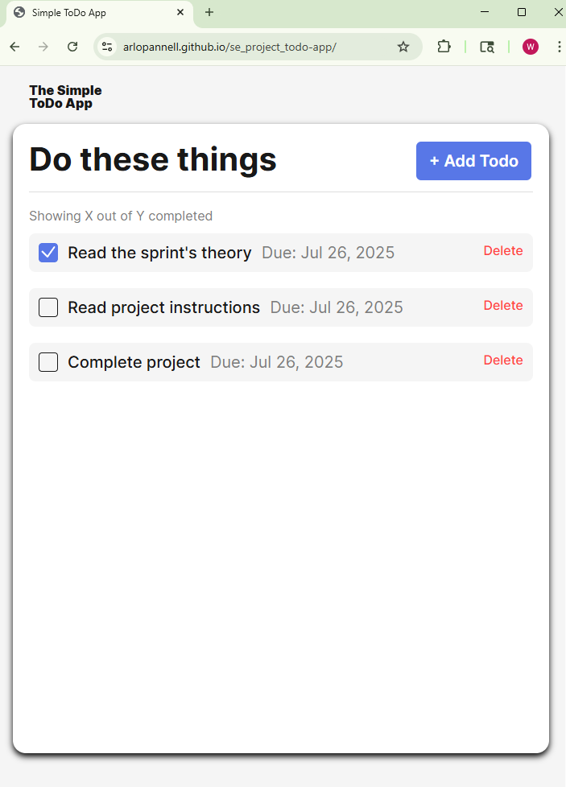
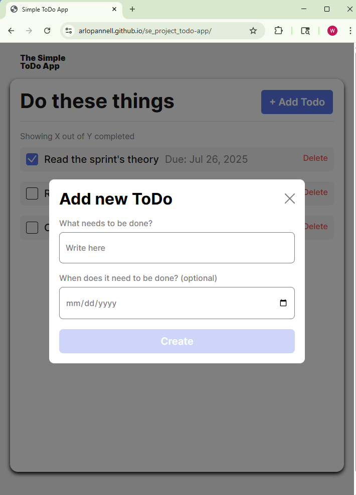
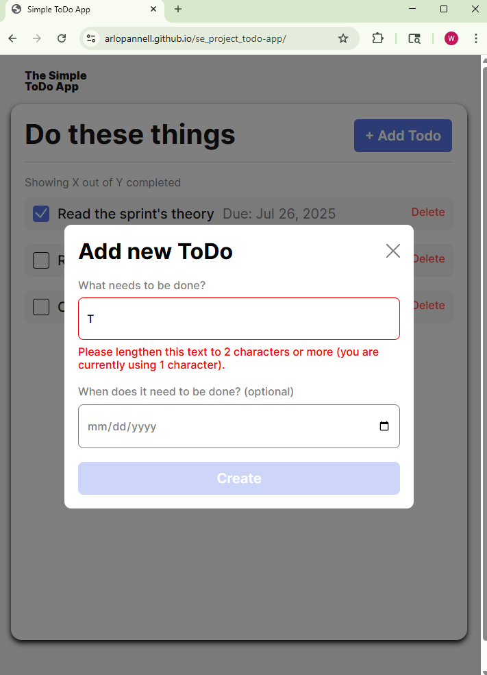

# Simple Todo App

This is a simple Task list, providing practice re-factoring code to use classes rather than functions.

## Functionality

It lets you create a simple to do list that lasts as long as you leave the browser window open. Each task can be checked off as completed, or deleted entirely from the list.

## Technology

Sample project, implementing javascript modules and classes, practice in OOP. Each task receives a unique id value from an external module -- u4 available at:
https://jspm.dev/uuid

## Deployment

This project is deployed on GitHub Pages:

https://arlopannell.github.io/se_project_todo-app/

## Scrennshots

### Main Screen

### Task Entry Form

### Form Validation

### New Task added, items can be checked off the list

